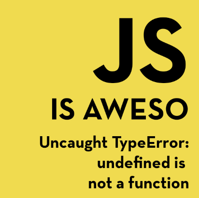

> 📚 Cheatsheets for JavaScript and friends! Basically copied from here n there...

## 📚 Contents

### 📃 JavaScript

View

#### Vanilla JS
- [Statements in JS](javascript/statements-in-js.md)
- [Loops in JS](javascript/loops-in-js.md)

#### ES6 and beyond...
- [Test](javascript/test.md)

#### Code Snippet
- [Test](javascript/test.md)

### 📃 React & Friends

View

#### React
- [Class Component](reactjs/class-component.md)
- [Functional Component](reactjs/functional-component.md)
- [Pure Component](reactjs/pure-component.md)
- [Method Binding](reactjs/method-binding.md)
- [Prop Types](reactjs/prop-types.md)
- [Communication between Components](reactjs/pure-component.md)
- [React Fragment](reactjs/pure-component.md)
- [React Memo](reactjs/react-memo.md)

#### React Hooks

#### React Router
- [Test](reactjs/test.md)

#### Redux
- [Test](reactjs/test.md)

#### Hooks
- [Test](reactjs/test.md)

### 📃 Tools

View

#### Git
- [Git Emoji :)](tools/git-emoji.md)
- [Git Commands](tools/git-commands.md)

#### VSCode
- [VSCode Settings](tools/vscode-settings.json)
- [VSCode Shortcuts](tools/vscode-shortcuts.md)
#### Bash
- [Test](javascript/test.md)

#### VIM
- [VIM Commands](tools/vim-commands.md)

#### Docker
- [Docker Reference](tools/docker-reference.md)

### 📃 HTML & CSS
- [HTML5 Cheatsheet](html-css/html5.html)
- [CSS Reference](html-css/css-reference.md)

## PR's are most welcome!

